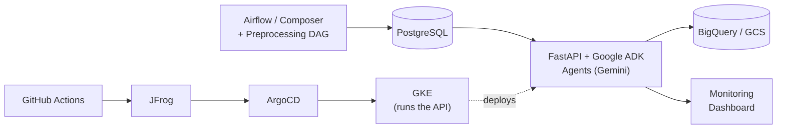

# Agentic AI for Production Support

**Reimagining production support with agents: a shift in the operating model, not just task automation.**

Instead of an engineer manually triaging every pipeline failure, an agent investigates first — gathering evidence, determining root cause, and either safely remediating the issue or escalating it to a human when the situation calls for judgment.

---

## The Problem

In a traditional, human-led support model, every failure — no matter how routine — follows the same expensive path:

- An engineer opens and reviews 1,000+ lines of logs
- Manually investigates the root cause
- Checks retry history and current production state
- Decides whether to retry or escalate
- Takes manual action

This means engineering time is spent re-investigating the same known failure patterns over and over, and response time depends on whoever is on shift.

## The Shift: Agent-Led, Human-on-Exceptions

In the agent-first model, an agent becomes the first line of production support:

| Traditional Production Support | Agent-First Production Support |
|---|---|
| Engineer opens and reviews 1,000+ lines of logs | Agent analyzes logs and failure context |
| Identifies the actual error | Identifies root cause and supporting evidence |
| Investigates root cause | Checks retry history and current production state |
| Checks retry history and production impact | Determines the safest next action |
| Engineer decides retry vs. escalate | **Known/safe failure →** agent handles remediation |
| Engineer investigates every failure | **Complex/uncertain failure →** human engineer takes over |

Humans move from investigating *every* failure to handling only the cases that actually need judgment.

## Architecture

```
Airflow / Composer
        │
        ▼
Task Failure → Failure Monitoring + Logs → Preprocessing & Enrichment
        │
        ▼
                    MASTER AGENT (understand + route)
        ┌─────────────────┬──────────────────────┐
        ▼                 ▼                       ▼
  Schema & Data      Infrastructure &        Default Agent
  Quality Agent      Connectivity Agent
        │                  │                       │
        ▼                  ▼                       ▼
 ┌───────────────┐  ┌───────────────────┐  ┌───────────────┐
 │ get_table_    │  │ is_record_latest  │  │ get_table_    │
 │ schema        │  └───────────────────┘  │ schema        │
 └───────────────┘  ┌───────────────────┐  └───────────────┘
 ┌───────────────┐  │ trigger_dag_retry │  ┌───────────────┐
 │ query_table_  │  └───────────────────┘  │ query_table_  │
 │ count         │  ┌───────────────────┐  │ count         │
 └───────────────┘  │ record_retry_     │  └───────────────┘
 ┌───────────────┐  │ attempt           │  ┌───────────────┐
 │ execute_query │  └───────────────────┘  │ execute_query │
 └───────────────┘  ┌───────────────────┐  └───────────────┘
                     │ update_infra_     │
                     │ job_status        │
                     └───────────────────┘
        │                  │                       │
        └──────────────────┴───────────────────────┘
                            ▼
                 ┌───────────────────────────┐
                 │       Shared Tools        │
                 ├───────────────────────────┤
                 │ fetch_airflow_log         │
                 │ search_log                │
                 │ read_log_section          │
                 │ send_email                │
                 │ update_job_status         │
                 └───────────────────────────┘
                            ▼
               Tools + Evidence → RCA + Decision
                            │
                 ┌──────────┴──────────┐
                 ▼                     ▼
         Safe Remediation      Human Escalation
```

A failure comes in, agents investigate, tools gather evidence, and the system either acts safely or escalates to a human.

**Stack:** Google ADK · Gemini · Airflow / Composer · PostgreSQL · BigQuery · FastAPI

## Tech Stack

**Airflow / Composer · PostgreSQL · Google ADK · Gemini · FastAPI · BigQuery · GCS · Docker · GitHub Actions · JFrog · Helm · ArgoCD · GKE · Istio**



## Example: Handling a Connection Timeout

A walkthrough of one real failure, end to end:

1. **Failure Detected** — An Airflow task fails with `"Connection timeout while connecting to Snowflake"`. The Master Agent identifies it as an infrastructure/connectivity issue and routes it to the Infrastructure Agent.
2. **Classify & Route** — The agent asks: does the error look transient?
3. **Check Before Acting** — Before doing anything, the agent verifies:
   - Is this still the latest failure?
   - Is this DAG approved for auto-retry?
   - How many retries have already happened?
4. **Decision:**
   - **Transient + checks pass →** safe retry → track outcome → success → close
   - **Persistent / uncertain →** routed to human review

The agent doesn't retry just because it sees an error — it verifies the situation first.

## Building Trust: Production Guardrails

LLM reasoning is used to *investigate*. Deterministic controls decide what's allowed to *happen* in production.

Automated action is only allowed when **all** of the following hold:

- The DAG is approved for automated retry
- The incident is still the latest failure
- The current task is actually failed
- Retry count is below the limit
- The failure is recent
- Evidence supports a transient issue
- RCA is supported by evidence, with full incident and retry history available

**If evidence is incomplete or uncertain → the case goes to human investigation.**

This combination of LLM reasoning plus deterministic production controls is what enables a **~80–90% reduction in manual RCA effort** without compromising safety.

## Measured Impact in Production

Three KPIs tracked during rollout:

| KPI | Result | What it means |
|---|---|---|
| **Cost** — Investigation Efficiency | **80–90%** of failures resolved with no engineer investigating | Out of 10 pipeline failures, 8–9 get an RCA and fix sent straight to the data team with zero engineer time. Only 1–2 out of 10 are escalated to a person. |
| **Experience** — Response Time | **1–3 min**, consistent automated response, handled in parallel | Replaces a shift-dependent, queue-based response — e.g., 5 pipelines failing overnight no longer queue behind the on-shift engineer; all 5 are answered within minutes. |
| **Trust** — Safety & Quality | **98–99%** of automated actions were correct and safe | Roughly 1–2 of every 100 attempted retries needed a human correction, measured during early rollout. |

Engineers now spend their time on the 1–2 failures that need judgment — not on the 8–9 that don't.

---
