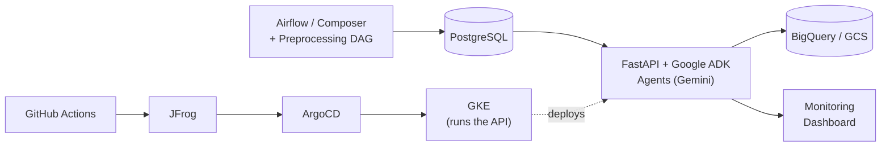

# Agentic AI for Production Support

Instead of an engineer manually triaging every pipeline failure, an agent investigates first — gathering evidence, determining root cause, and either safely remediating the issue or escalating it to a human when the situation calls for judgment.

---
Use this short version in the README, and then explain it using the detailed script:

## The Problem

Our production environment had more than **1,500 Airflow Composer pipelines** running at different cadences and supporting downstream data and business reports.

When a pipeline failed, the production-support process was largely manual:

* Review 1,000+ lines of Airflow logs
* Investigate the source system, BigQuery, or other connected services to understand
* Identify the root cause and check retry history
* Apply a fix and retry, or escalate the issue to the appropriate data team

A routine investigation took approximately **12–15 minutes per failure**, and multiple failures could quickly create a support queue.


Replace the table with this. It keeps the idea but reads like a project README rather than a presentation slide.

## The Solution

I designed and built an **Agentic AI production-support application** that automates the investigation workflow—from analyzing logs and gathering evidence to identifying the root cause and determining the next action.

The agent acts as the first line of production support while keeping a human in the loop for risky, complex, or uncertain situations.

```text
Pipeline Failure
      ↓
Agent Investigation and RCA
      ↓
Known and Safe → Controlled Remediation
Complex or Uncertain → Human Escalation
```

Instead of starting every investigation from the beginning, engineers receive an incident with the root cause, supporting evidence, and recommended next steps already prepared.

## Architecture

```
Airflow / Composer
        │
        ▼
Task Failure → Failure Monitoring + Logs → Preprocessing & Enrichment
        │
        ▼
                    MASTER AGENT (understand + route)
        ┌─────────────────┬──────────────────────┐
        ▼                 ▼                       ▼
  Schema & Data      Infrastructure &        Default Agent
  Quality Agent      Connectivity Agent
        │                  │                       │
        ▼                  ▼                       ▼
 ┌───────────────┐  ┌───────────────────┐  ┌───────────────┐
 │ get_table_    │  │ is_record_latest  │  │ get_table_    │
 │ schema        │  └───────────────────┘  │ schema        │
 └───────────────┘  ┌───────────────────┐  └───────────────┘
 ┌───────────────┐  │ trigger_dag_retry │  ┌───────────────┐
 │ query_table_  │  └───────────────────┘  │ query_table_  │
 │ count         │  ┌───────────────────┐  │ count         │
 └───────────────┘  │ record_retry_     │  └───────────────┘
 ┌───────────────┐  │ attempt           │  ┌───────────────┐
 │ execute_query │  └───────────────────┘  │ execute_query │
 └───────────────┘  ┌───────────────────┐  └───────────────┘
                     │ update_infra_     │
                     │ job_status        │
                     └───────────────────┘
                     ┌───────────────────┐
                     │ ping_external_db  │
                     └───────────────────┘
        │                  │                       │
        └──────────────────┴───────────────────────┘
                            ▼
                 ┌───────────────────────────┐
                 │       Shared Tools        │
                 ├───────────────────────────┤
                 │ fetch_airflow_log         │
                 │ search_log                │
                 │ read_log_section          │
                 │ send_email                │
                 │ update_job_status         │
                 │ provide_feedback          │
                 │ check_source_file         │
                 └───────────────────────────┘
                            ▼
               Tools + Evidence → RCA + Decision
                            │
                 ┌──────────┴──────────┐
                 ▼                     ▼
         Safe Remediation      Human Escalation
```

A failure comes in, agents investigate, tools gather evidence, and the system either acts safely or escalates to a human.

## Tech Stack

**Airflow / Composer · PostgreSQL · Google ADK · Gemini · FastAPI · BigQuery · GCS · Docker · GitHub Actions · JFrog · ArgoCD · GKE**



## End-to-End Example: Schema Mismatch

Consider an Airflow task that fails because a column available in the source table is missing from the target table.

1. **Submit the Failure**
   The preprocessing workflow captures the failed task, prepares the relevant log context, and submits it to the Master Agent.

2. **Classify and Route**
   The Master Agent identifies the error as a schema mismatch and transfers the incident to the Schema and Data Quality Agent.

3. **Validate the Schemas**
   The specialist agent retrieves and compares the source and target table schemas to verify the missing column.

4. **Identify the Root Cause**
   The agent confirms that the source schema changed but the corresponding target schema and pipeline mapping were not updated.

5. **Complete the Investigation**
   The agent sends the responsible data team an RCA with the affected table, missing column, supporting evidence, and recommended fix. It then updates the incident status as completed.

If the schemas or required evidence cannot be retrieved, the agent escalates the incident for manual investigation instead of making an unsupported conclusion.


Use **“Production Safety and Guardrails”** as the heading. It sounds more like engineering documentation than a presentation.

## Production Safety and Guardrails

Because the agent interacts with production systems, the LLM is not given direct authority to perform an action. The LLM investigates the failure and recommends a next step, while deterministic logic inside the tools decides whether the action is allowed.

```text
LLM Investigation
       ↓
Recommended Action
       ↓
Deterministic Tool Validation
       ↓
Execute Safely or Escalate to a Human
```

Before triggering a retry, the tool verifies that:

* The DAG is approved for automated retry
* Live Airflow validation has been completed
* The incident represents the latest failed task
* The retry and failure-age limits have not been exceeded


## Production Impact

| Metric                       | Observed Result                                                                                                                             |
| ---------------------------- | ------------------------------------------------------------------------------------------------------------------------------------------- |
| **Manual investigation**     | **80–90%** of supported failures received an automated RCA with the exact root cause, supporting evidence, and specific steps to resolve the issue—without requiring an initial manual investigation.
| **Time to initial RCA**      | Reduced from approximately **12–15 minutes manually** to **1–3 minutes automatically**                                                      |
| **Automated action quality** | **98–99%** of automated actions required no human correction during the initial rollout                                                     |

---
